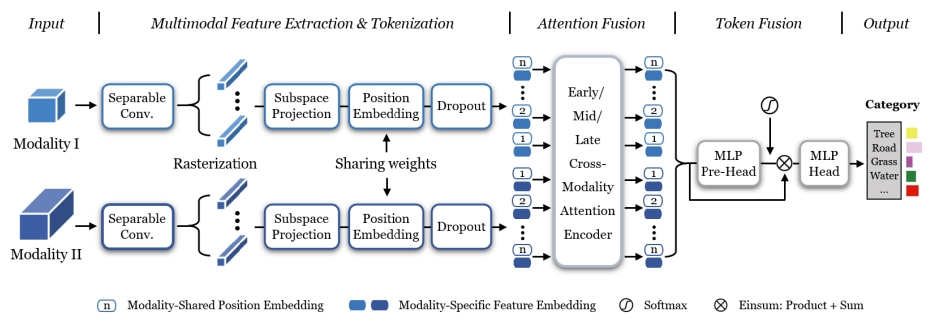

# ExViT

[Extended Vision Transformer (ExViT) for Land Use and Land Cover Classification: A Multimodal Deep Learning Framework](https://ieeexplore.ieee.org/document/10147258)

A joint work with [Danfeng Hong](https://github.com/danfenghong).

Users can manually download the investigated Houston 2013 datasets on https://pan.baidu.com/s/1bBQXAWam2GOwZN9obtCrfQ?pwd=rwu5 using key: rwu5.

Citation
---------------------

**Please kindly cite the papers if this code is useful and helpful for your research.**

Jing Yao, Bing Zhang, Chenyu Li, Danfeng Hong, Jocelyn Chanussot. Extended vision transformer (ExViT) for land use and land cover classification: A multimodal deep learning framework, IEEE Transactions on Geoscience and Remote Sensing, 2023, vol. 61, pp. 1-15, Art no. 5514415, doi: 10.1109/TGRS.2023.3284671.

    @article{yao2023extended,
      title={Extended vision transformer (ExViT) for land use and land cover classification: A multimodal deep learning framework},
      author={Yao, Jing and Zhang, Bing and Li, Chenyu and Hong, Danfeng and Chanussot, Jocelyn},
      journal={IEEE Transactions on Geoscience and Remote Sensing},
      year={2023},
      volume={61},
      pages={1-15},
      note={DOI: 10.1109/TGRS.2023.3284671},
      publisher={IEEE}
    }
